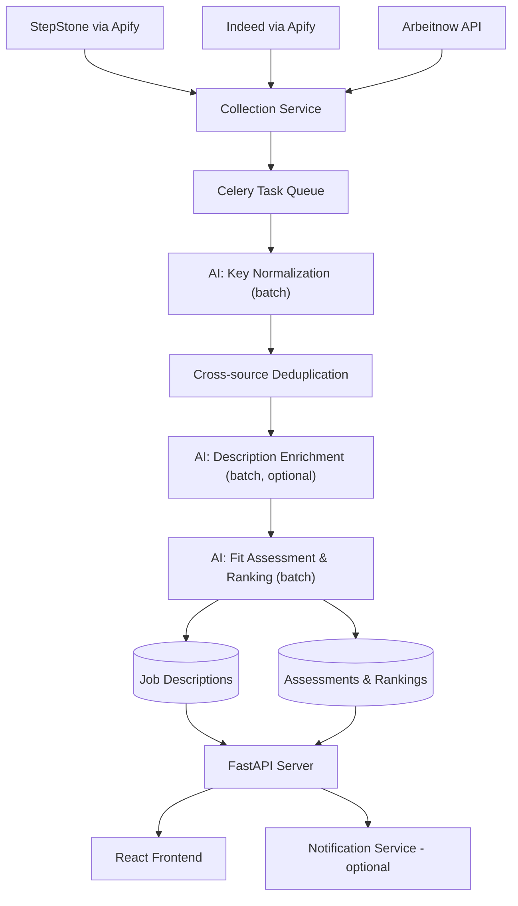
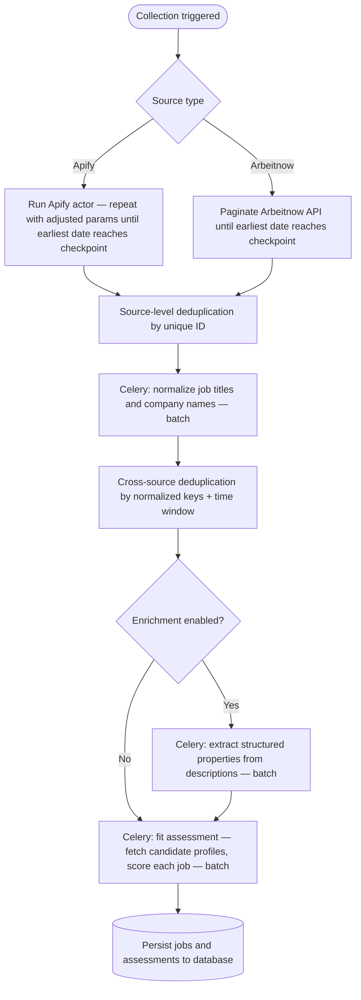

# German IT Job Aggregation Service

Aggregates job postings from multiple sources, normalizes them into a common schema, and supports candidate-job matching and ranking.

## What this service does

- Collects jobs from multiple providers.
- Normalizes and deduplicates records using AI-assisted key normalization.
- Supports AI-powered matching and enrichment workflows.
- Exposes job data and candidate state through an API.
- Powers a frontend for job discovery and application tracking.

## Supported sources

| Source | Integration |
|---|---|
| StepStone | via Apify |
| Indeed | via Apify |
| Arbeitnow | Direct API |

## Tech stack highlights

| Concern | Technology |
|---|---|
| Pipeline orchestration | Celery + Redis |
| AI agents | PydanticAI + Anthropic |
| API | FastAPI |
| Frontend | React |

---

## High-level architecture

---

## Service components

### Collection service

Ingests job postings from all supported sources and maps them to a shared schema. Manages source-specific collectors and hands completed batches off to the processing pipeline.

#### Collectors

Source-specific adapters that handle the details of each provider's API.

- `ApifyCollector` — integrates with the Apify platform to run and retrieve actor results.
- `ArbeitnowCollector` — calls the Arbeitnow REST API directly.

### Processing pipeline

A Celery task chain that transforms and validates each batch of collected jobs before writing them to the database. All AI steps operate on batches to reduce latency and API cost.

| Step | Responsibility |
|---|---|
| Key normalization | Consistent job title and company name across sources |
| Cross-source deduplication | Collapse duplicate postings from different providers |
| Description enrichment *(optional)* | Extract structured properties from free-text descriptions |
| Fit assessment & ranking | Score each job against all candidate profiles; write assessments to a separate collection |
| Persistence | Write jobs and assessments to the database |

### AI agent — key normalization

A PydanticAI agent that standardizes job titles and company names across sources. Consistent keys are a prerequisite for reliable cross-source deduplication.

### AI agent — description enrichment *(optional)*

A PydanticAI agent that extracts structured properties from job description text — for example, tech stack, required seniority, and years of experience. Enables personalized candidate feeds without per-candidate fit scoring on every job.

### AI agent — fit assessment and ranking

A PydanticAI agent that runs as part of the processing pipeline. After deduplication and optional enrichment, it fetches all candidate profiles and scores each incoming job against them. Results are written to a separate assessments collection so that job records and fit scores remain independently queryable.

### API server (`FastAPI`)

Provides REST endpoints for fetching and filtering ranked job feeds, managing candidate profiles, and tracking application status (applied, shortlisted, rejected, etc.).

### Frontend (`React`)

User interface for profile management, browsing ranked jobs, and tracking application progress.

### Notification service *(optional)*

Sends digest or real-time notifications about new relevant jobs based on candidate preferences.

---

## Job processing flow

