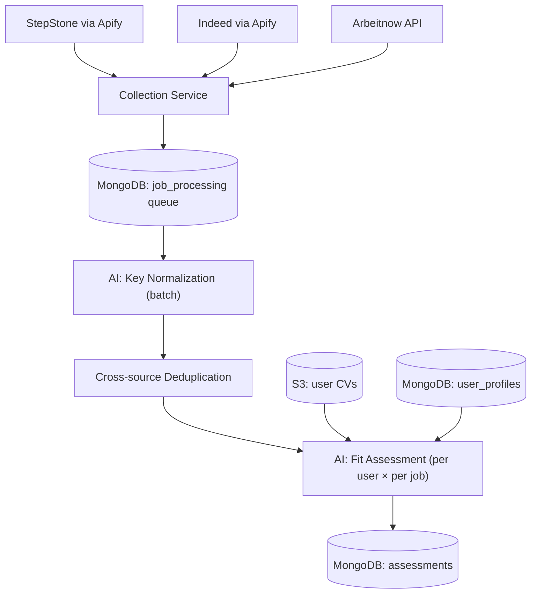
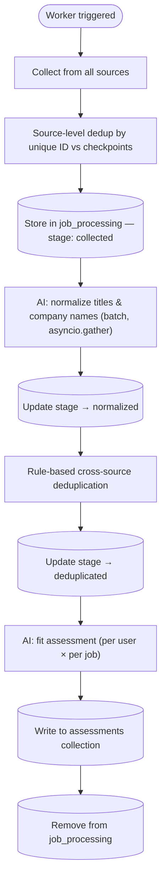

# German IT Job Aggregation Service

Aggregates job postings from multiple sources, normalizes them into a common schema, and supports candidate-job matching and ranking.

## What this service does

- Collects jobs from multiple providers.
- Normalizes and deduplicates records using AI-assisted key normalization.
- Scores each surviving job against all candidate profiles using an AI fit assessment agent.
- Stores assessments separately for independent querying.

## Supported sources

| Source | Integration |
|---|---|
| StepStone | via Apify |
| Indeed | via Apify |
| Arbeitnow | Direct API |

## Tech stack highlights

| Concern | Technology |
|---|---|
| Pipeline orchestration | MongoDB stage queue + async worker |
| AI agents | PydanticAI + OpenAI |
| Object storage | S3-compatible (MinIO etc.) |
| Package manager | uv |

---

## High-level architecture


```mermaid
flowchart TD
    SS[StepStone via Apify] --> COL[Collection Service]
    IN[Indeed via Apify] --> COL
    AN[Arbeitnow API] --> COL

    COL --> Q[(MongoDB: job_processing queue)]

    Q --> KN["AI: Key Normalization (batch)"]
    KN --> DD[Cross-source Deduplication]
    DD --> AIFIT["AI: Fit Assessment (per user × per job)"]

    AIFIT --> AS[(MongoDB: assessments)]

    S3[(S3: user CVs)] --> AIFIT
    UP[(MongoDB: user_profiles)] --> AIFIT
```

---

## Service components

### Collection service

Ingests job postings from all supported sources and maps them to a shared schema. Manages source-specific collectors and writes completed batches to the MongoDB processing queue.

#### Collectors

Source-specific adapters that handle the details of each provider's API.

- `ApifyCollector` — integrates with the Apify platform to retrieve actor results (by default fetches the last successful run's dataset without triggering a new run).
- `ArbeitnowCollector` — paginates the Arbeitnow REST API and filters postings to those mentioning Python in the description.

### Processing pipeline

A MongoDB-backed stage queue replaces Celery. Each document in the `job_processing` collection carries a `pipeline_stage` field. A single async worker script (`workers/job_processing.py`) advances documents through stages sequentially in one process.

| Stage | Responsibility |
|---|---|
| `collected` | Job ingested from source; awaiting AI normalization |
| `normalized` | Title and company normalized; awaiting deduplication |
| `deduplicated` | Confirmed unique; awaiting fit assessment |

Processed jobs are removed from the queue after assessment. Up to 50 documents are processed per stage per worker run.

### AI agent — key normalization

A PydanticAI agent (`agents/deduplication.py`) that standardizes job titles and company names across sources. Operates on configurable batches (default 50) with concurrent `asyncio.gather` calls. Consistent keys are a prerequisite for reliable cross-source deduplication.

### Deduplication

Rule-based, no LLM involved:

1. Drop UIDs already present in the `jobs` collection.
2. Intra-batch collapse on `(title_normalized, company_normalized)`, keeping the newest `posted_at`.
3. Cross-run: drop if the same normalized key exists in `jobs` with a `posted_at` within 60 days.

### Fit assessment pipeline

A PydanticAI agent (`agents/fit_assessment.py`) that scores each deduplicated job against every candidate profile. For each user × job pair it receives the user's profile JSON plus their PDF CV (fetched from S3) and returns:

- `cv_ats_match_score`
- `profile_ats_match_score`
- `deal_breakers`
- `summary`

Results are written to a separate `assessments` collection so job records and fit scores remain independently queryable.

### MongoDB collections

| Collection | Purpose |
|---|---|
| `job_processing` | In-flight pipeline queue |
| `checkpoints` | Per-source `posted_at` high-water mark |
| `jobs` | Canonical job store (write path exists; not yet called by the pipeline) |
| `failed_entries` | Ingestion and normalization failures |
| `user_profiles` | Candidate profiles used for fit assessment |
| `assessments` | `{username, job_uid, assessment}` fit results |

### Object storage (S3-compatible)

User CVs are stored at `job-aggregator/{username}/cv.pdf` and fetched at assessment time. The endpoint is configurable via `S3_ENDPOINT_URL` to support MinIO or any S3-compatible service.

---

## Job processing flow


```mermaid
flowchart TD
    A([Worker triggered]) --> B[Collect from all sources]

    B --> C[Source-level dedup by unique ID vs checkpoints]
    C --> D[(Store in job_processing — stage: collected)]

    D --> E["AI: normalize titles & company names (batch, asyncio.gather)"]
    E --> F[(Update stage → normalized)]

    F --> G[Rule-based cross-source deduplication]
    G --> H[(Update stage → deduplicated)]

    H --> I["AI: fit assessment (per user × per job)"]
    I --> J[(Write to assessments collection)]
    J --> K[(Remove from job_processing)]
```

---

## Development setup

```bash
# install dependencies
uv sync

# configure secrets (copy and fill in values)
cp .env.example .env   # or create .env manually

# run the pipeline worker
uv run python workers/job_processing.py

# run tests (skips priced API/LLM tests by default)
uv run pytest

# include tests that call Apify or OpenAI
uv run pytest --run-priced
```

### Required environment variables

| Variable | Purpose |
|---|---|
| `OPENAI_API_KEY` | LLM calls (gpt-5-mini) |
| `APIFY_API_KEY` | Apify authentication |
| `MONGODB_USER`, `MONGODB_PASSWORD` | MongoDB auth |
| `MONGODB_HOST`, `MONGODB_PORT` | MongoDB host (defaults: `localhost`, `27017`) |
| `S3_ENDPOINT_URL` | S3-compatible storage endpoint |
| `S3_ACCESS_KEY`, `S3_SECRET_KEY` | S3 credentials |
| `S3_REGION`, `S3_BUCKET_NAME` | S3 bucket config |
| `APIFY_INDEED_TASK_ID` | Apify actor task for Indeed |
| `APIFY_STEPSTONE_TASK_ID` | Apify actor task for StepStone |

Optional tuning variables: `DEDUPLICATION_BATCH_SIZE`, `ARBEITNOW_MAX_PAGES`, `DEBUG_MODE`, `LOG_DIR`, and per-collection name overrides (`MONGODB_JOBS_COLLECTION`, `MONGODB_PROCESSING_COLLECTION`, etc.).

---

## Roadmap

- Persist deduplicated jobs to the `jobs` collection.
- Description enrichment agent to extract structured properties from free-text.
- Rule-based hard requirement filter (language, technologies, seniority) before AI scoring.
- FastAPI REST server for job feeds, profile management, and application tracking.
- React frontend for job discovery and application progress.
- Notification service for new relevant jobs.
- Hybrid vector + BM25 candidate-job ranking (design in `docs/candidate-job-ranking.md`).
