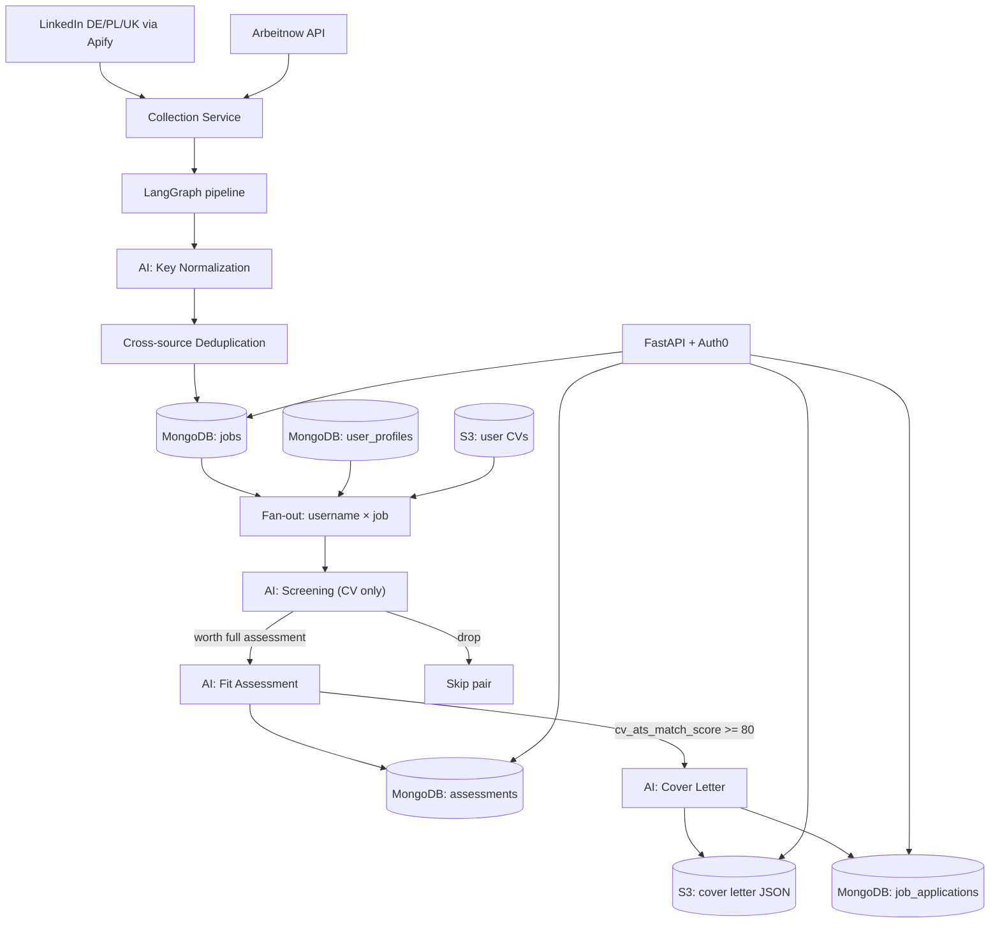
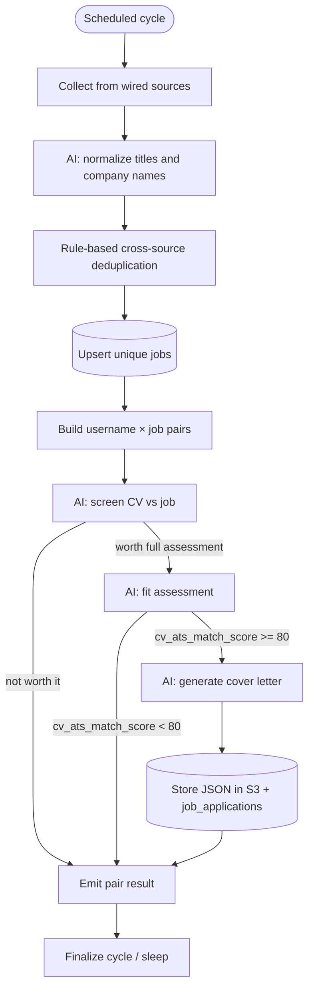

# German IT Job Aggregation Service

Aggregates job postings from multiple sources, normalizes them into a common schema, and supports candidate-job matching, ranking, and cover-letter generation.

## What this service does

- Collects jobs from multiple providers (LinkedIn DE/PL/UK via Apify, Arbeitnow API).
- Normalizes and deduplicates records using AI-assisted key normalization.
- Screens each surviving job against each candidate CV (cheap keep/drop) before the expensive fit assessment.
- Scores kept jobs against candidate profiles using an AI fit assessment agent.
- Generates structured cover letters for high-fit jobs and stores them in object storage.
- Exposes a FastAPI REST API (Auth0) for the job feed, application status, and cover letters.

## Supported sources

| Source | Integration | Wired in pipeline |
|---|---|---|
| LinkedIn (DE) | Apify | yes |
| LinkedIn (Poland) | Apify | yes |
| LinkedIn (United Kingdom) | Apify | yes |
| Arbeitnow | Direct API | yes (Python-keyword filter) |
| StepStone | Apify parser exists | no |
| Indeed | Apify parser exists | no |

Apify collectors fetch the last successful actor run's dataset by default (`run_apify_task=False`) and do not trigger a new scrape.

## Tech stack highlights

| Concern | Technology |
|---|---|
| Pipeline orchestration | LangGraph + MongoDB checkpointer |
| HTTP API | FastAPI |
| Auth | Auth0 |
| AI agents | PydanticAI (OpenAI + xAI/Grok) |
| Object storage | S3-compatible (MinIO etc.) |
| Packaging / run | uv, Docker, GHCR |

---

## High-level architecture


```mermaid
flowchart TD
    LI[LinkedIn DE/PL/UK via Apify] --> COL[Collection Service]
    AN[Arbeitnow API] --> COL

    COL --> LG[LangGraph pipeline]
    LG --> KN[AI: Key Normalization]
    KN --> DD[Cross-source Deduplication]
    DD --> JOBS[(MongoDB: jobs)]

    JOBS --> FAN[Fan-out: username × job]
    UP[(MongoDB: user_profiles)] --> FAN
    S3[(S3: user CVs)] --> FAN

    FAN --> SCR["AI: Screening (CV only)"]
    SCR -->|worth full assessment| AIFIT["AI: Fit Assessment"]
    SCR -->|drop| SKIP[Skip pair]

    AIFIT --> AS[(MongoDB: assessments)]
    AIFIT -->|cv_ats_match_score >= 80| CL[AI: Cover Letter]
    CL --> S3CL[(S3: cover letter JSON)]
    CL --> APP[(MongoDB: job_applications)]

    API[FastAPI + Auth0] --> JOBS
    API --> AS
    API --> APP
    API --> S3CL
```

---

## Service components

### Collection service

Ingests job postings from all wired sources and maps them to a shared schema. Manages source-specific collectors and returns a batch for the pipeline.

#### Collectors

Source-specific adapters that handle the details of each provider's API.

- `ApifyCollector` — retrieves Apify actor results (by default the last successful run's dataset, without triggering a new run). Used for LinkedIn DE / Poland / UK with `LinkedinApifyParser`.
- `ArbeitnowCollector` — paginates the Arbeitnow REST API and keeps postings that mention Python in the description.

StepStone and Indeed Apify parsers remain in the repo but are not attached to the running collector list.

### Processing pipeline (LangGraph)

The scheduled pipeline lives in `orchestration/` and is the primary processing path. One cycle collects, normalizes, deduplicates, persists unique jobs, then fans out over every `(username, job)` pair.

```bash
uv run run-pipeline
# equivalent: python -m orchestration
```

Design details: [`docs/langgraph-orchestration.md`](docs/langgraph-orchestration.md).

| Stage | Responsibility |
|---|---|
| `collect` | Ingest from wired sources |
| `normalize` | AI-normalize title and company |
| `dedupe` | Rule-based cross-source uniqueness |
| `persist_jobs` | Upsert survivors into `jobs` |
| `build_pairs` | Cartesian product of users × unique jobs |
| `screen` | CV-only keep/drop |
| `assess` | Full fit assessment (if screening says yes) |
| `cover_letter` | Generate + store letter (if CV ATS score ≥ threshold) |

Pair work is concurrent (`PIPELINE_PAIR_CONCURRENCY`, default 10). Progress is checkpointed in MongoDB (`langgraph_checkpoints`); pair nodes are idempotent and reuse existing screenings, assessments, and cover-letter keys.

A legacy MongoDB stage-queue worker (`workers/job_processing.py`) still exists as a parallel path. It does not run screening and does not use LangGraph checkpoints.

### AI agent — key normalization

A PydanticAI agent (`agents/deduplication.py`) that standardizes job titles and company names across sources. Operates on configurable batches (default 50) with concurrent `asyncio.gather` calls. Consistent keys are a prerequisite for reliable cross-source deduplication.

### Deduplication

Rule-based, no LLM involved:

1. Drop UIDs already present in the `jobs` collection.
2. Intra-batch collapse on `(title_normalized, company_normalized)`, keeping the newest `posted_at`.
3. Cross-run: drop if the same normalized key exists in `jobs` with a `posted_at` within 60 days.

### Screening agent

A PydanticAI agent (`agents/screening.py`) that, given only the candidate CV and the job posting, decides `worth_full_assessment` plus a confidence. Used as a cheap gate before fit assessment. Results are stored in `screenings` (unique on `(username, job_uid)`).

Offline evaluation: [`benchmarks/screening/README.md`](benchmarks/screening/README.md).

### Fit assessment pipeline

A PydanticAI agent (`agents/fit_assessment.py`) that scores each screened-in job against a candidate profile. For each user × job pair it receives the user's profile JSON plus their PDF CV (fetched from S3) and returns:

- `cv_ats_match_score`
- `profile_ats_match_score`
- `deal_breakers`
- `summary`

Results are written to a separate `assessments` collection so job records and fit scores remain independently queryable.

Offline evaluation: [`benchmarks/fit_assessment/README.md`](benchmarks/fit_assessment/README.md).

### Cover letter generation

A PydanticAI agent (`agents/cover_letter_generation.py`) that produces structured `CoverLetterContent` (contact header + titled sections) from the profile, posting, and fit assessment. Triggered when `cv_ats_match_score >= COVER_LETTER_MIN_CV_SCORE` (default 80).

JSON is stored at `job-aggregator/{username}/cover_letters/{job_uid}.json`. The API can return that JSON or render a PDF on the fly (`tools/pdf_generator.py`). The corresponding `job_applications` row records `cover_letter_key`.

### FastAPI service

Entry point: `main.py` (`uv run fastapi run` / `uv run fastapi dev`).

| Area | Endpoints |
|---|---|
| Auth | `POST /users/login`, `POST /users/refresh` (Auth0) |
| Job feed | `POST /jobs/search` — paginated, filterable, sorted feed of job + fit + application status |
| Application status | `PATCH /jobs/{job_uid}/status` |
| Cover letters | `GET /jobs/{job_uid}/cover-letter`, `GET /jobs/{job_uid}/cover-letter-pdf`, `PATCH /jobs/{job_uid}/cover-letter` |

Job-feed queries support remote/source/tag/location filters, ATS score floors, deal-breaker exclusion, and application-stage flags (`applied`, `skipped`, `active_only`).

The Docker image (`Dockerfile`) runs this API. Version tags `v*` are built and pushed to GHCR (`.github/workflows/docker-publish.yml`).

### MongoDB collections

| Collection | Purpose |
|---|---|
| `jobs` | Canonical job store (upserted after deduplication) |
| `checkpoints` | Per-source collector `posted_at` high-water mark |
| `user_profiles` | Candidate profiles used for fit assessment |
| `screenings` | `{username, job_uid, worth_full_assessment, confidence}` |
| `assessments` | `{username, job_uid, assessment}` fit results |
| `job_applications` | Per-user application status and cover-letter keys |
| `failed_tasks` | Pipeline node failures (collect / normalize / pair LLM steps) |
| `langgraph_checkpoints` / `langgraph_checkpoint_writes` | LangGraph checkpointer |
| `job_processing` / `failed_entries` | Legacy stage-queue worker only |

### Object storage (S3-compatible)

| Object | Key |
|---|---|
| User CV | `job-aggregator/{username}/cv.pdf` |
| Cover letter JSON | `job-aggregator/{username}/cover_letters/{job_uid}.json` |

The endpoint is configurable via `S3_ENDPOINT_URL` to support MinIO or any S3-compatible service.

---

## Job processing flow


```mermaid
flowchart TD
    A([Scheduled cycle]) --> B[Collect from wired sources]
    B --> C[AI: normalize titles and company names]
    C --> D[Rule-based cross-source deduplication]
    D --> E[(Upsert unique jobs)]
    E --> F[Build username × job pairs]
    F --> G["AI: screen CV vs job"]
    G -->|not worth it| H[Emit pair result]
    G -->|worth full assessment| I["AI: fit assessment"]
    I -->|cv_ats_match_score < 80| H
    I -->|cv_ats_match_score >= 80| J["AI: generate cover letter"]
    J --> K[(Store JSON in S3 + job_applications)]
    K --> H
    H --> L[Finalize cycle / sleep]
```

Default schedule: every 12 hours (`PIPELINE_SCHEDULE_SECONDS`).

---

## Development setup

```bash
# install dependencies
uv sync

# configure secrets (copy and fill in values)
cp .env.example .env   # or create .env manually

# run the LangGraph pipeline
uv run run-pipeline

# run the HTTP API
uv run fastapi dev

# run tests (skips priced API/LLM tests by default)
uv run pytest

# include tests that call Apify or OpenAI
uv run pytest --run-priced

# offline agent benchmarks
uv run run-screening-benchmark
uv run run-fit-assessment-benchmark
```

### Required environment variables

| Variable | Purpose |
|---|---|
| `OPENAI_API_KEY` | OpenAI models (`gpt-5.6-luna`, `gpt-5-mini`) |
| `GROK_API_KEY` | xAI models (`grok-4.3`, `grok-4.5`) |
| `DEEPINFRA_API_KEY` | DeepInfra (configured; not the default pipeline models) |
| `APIFY_API_KEY` | Apify authentication |
| `MONGODB_USER`, `MONGODB_PASSWORD` | MongoDB auth |
| `MONGODB_HOST`, `MONGODB_PORT` | MongoDB host (defaults: `localhost`, `27017`) |
| `S3_ENDPOINT_URL` | S3-compatible storage endpoint |
| `S3_ACCESS_KEY`, `S3_SECRET_KEY` | S3 credentials |
| `S3_REGION`, `S3_BUCKET_NAME` | S3 bucket config |
| `AUTH0_DOMAIN`, `AUTH0_CLIENT_ID`, `AUTH0_CLIENT_SECRET`, `AUTH0_AUDIENCE` | API auth |
| `APIFY_LINKEDIN_TASK_ID` | LinkedIn DE Apify task |
| `APIFY_LINKEDIN_PL_TASK_ID` | LinkedIn Poland Apify task |
| `APIFY_LINKEDIN_UK_TASK_ID` | LinkedIn UK Apify task |

Optional tuning variables: `DEDUPLICATION_BATCH_SIZE`, `DEDUPLICATION_MODEL`, `SCREENING_MODEL`, `FIT_ASSESSMENT_MODEL`, `COVER_LETTER_MODEL`, `COVER_LETTER_MIN_CV_SCORE`, `PIPELINE_PAIR_CONCURRENCY`, `PIPELINE_SCHEDULE_SECONDS`, `ARBEITNOW_MAX_PAGES`, `DEBUG_MODE`, `LOG_DIR`, `TEMP_DIR`, and per-collection name overrides (`MONGODB_JOBS_COLLECTION`, `MONGODB_SCREENINGS_COLLECTION`, etc.). `LOG_DIR` and `TEMP_DIR` are resolved to absolute paths (relative values are interpreted against the application root) and may point outside the app directory in production.

Default models: screening and deduplication use `gpt-5.6-luna`; fit assessment and cover letters use `gpt-5-mini` on the LangGraph path.

---

## Roadmap

- Description enrichment agent to extract structured properties from free-text.
- Adjusted / tailored CV generation.
- Rule-based hard requirement filter (language, technologies, seniority) before AI scoring.
- React frontend for job discovery and application progress.
- Notification service for new relevant jobs.
- Hybrid vector + BM25 candidate-job ranking (design in `docs/candidate-job-ranking.md`).
