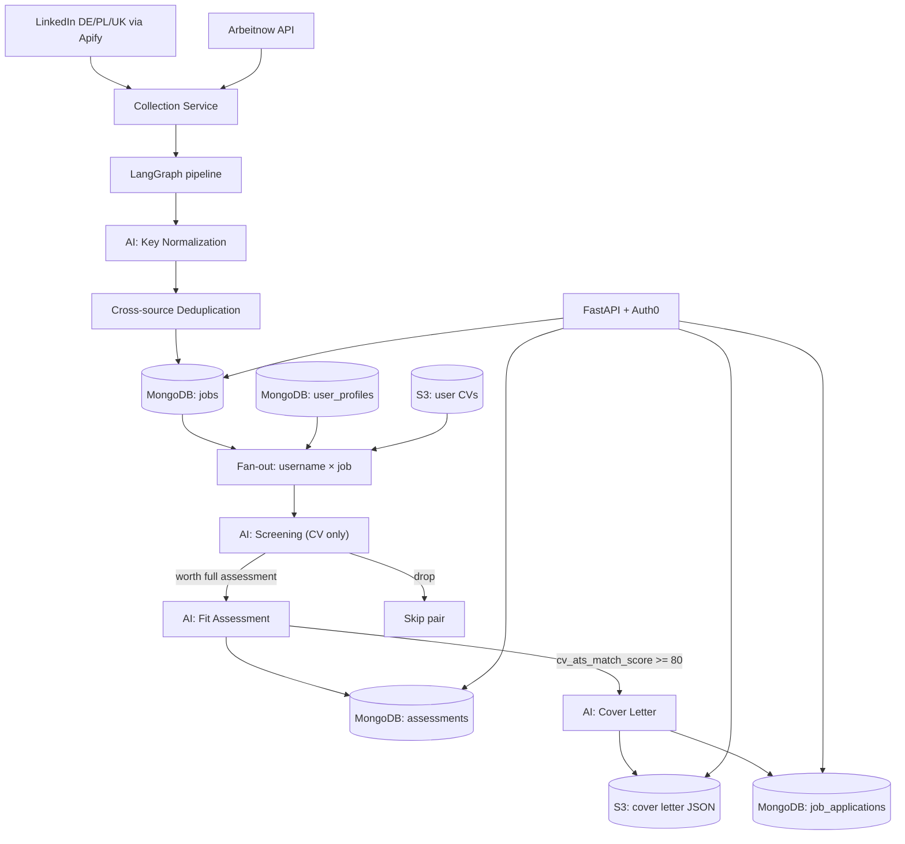
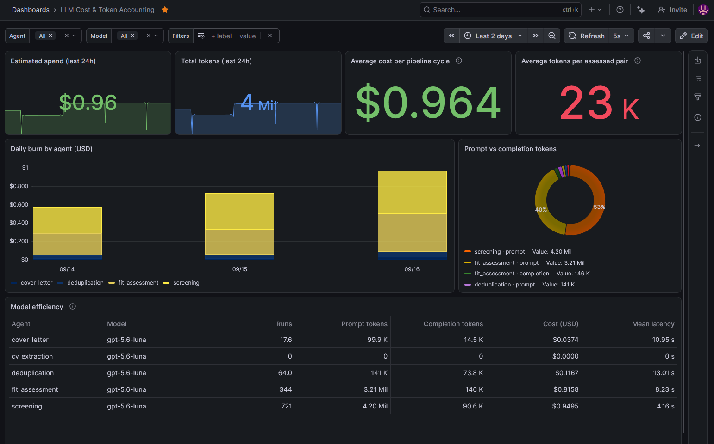

# Job Aggregator

Collects IT job postings, ranks them against a candidate CV, and drafts a cover letter for the roles worth applying to.

[job-aggregator-demo.webm](https://github.com/user-attachments/assets/825489a4-5cbe-425c-aaca-99a39820ad3a)

Recorded from the running deployment. The clip opens on **Sign in as demo**, then the job feed and the cover-letter modal. The client is [`job-aggregator-client`](https://github.com/cshadiev/job-aggregator-client).

One feed of roles from LinkedIn (DE, Poland, UK) and Arbeitnow, with a fit score on each row.
Hybrid retrieval and a screening model drop most pairs before the expensive fit assessment.
A role that clears the CV score gets a structured cover letter, and every model call is costed per agent.

## Headline numbers

Measured on corpus `05082026` (300 postings, one candidate). Screening and fit assessment in these figures are `gpt-5.6-luna`, the model the live environment runs.

| Figure | Value | Source |
|---|---|---|
| Pairs that never reach fit assessment | **79.7%** (61 of 300 assessed) | [composed gate](benchmarks/retrieval/reports/05082026_composed_gate.md) |
| LLM cost versus assessing every pair | **64.8%** lower ($0.695159 → $0.244757) | [composed gate](benchmarks/retrieval/reports/05082026_composed_gate.md) |
| Good recall of that gate | **0.7000** (21 of 30 top-tier jobs) | [composed gate](benchmarks/retrieval/reports/05082026_composed_gate.md) |
| Fitting recall of that gate | **0.5889** (53 of 90 viable jobs) | [composed gate](benchmarks/retrieval/reports/05082026_composed_gate.md) |

Hybrid retrieval at K=150, then screening at t=0.0. A miss by either gate counts.

## Architecture

```mermaid
flowchart TD
    LI[LinkedIn DE/PL/UK via Apify] --> COL[Collection Service]
    AN[Arbeitnow API] --> COL

    COL --> LG[LangGraph pipeline]
    LG --> KN[AI: Key Normalization]
    KN --> DD[Cross-source Deduplication]
    DD --> JOBS[(MongoDB: jobs)]

    JOBS --> FAN[Fan-out: username × job]
    UP[(MongoDB: user_profiles)] --> FAN
    S3[(S3: user CVs)] --> FAN

    FAN --> SCR["AI: Screening (CV only)"]
    SCR -->|worth full assessment| AIFIT["AI: Fit Assessment"]
    SCR -->|drop| SKIP[Skip pair]

    AIFIT --> AS[(MongoDB: assessments)]
    AIFIT -->|cv_ats_match_score >= 80| CL[AI: Cover Letter]
    CL --> S3CL[(S3: cover letter JSON)]
    CL --> APP[(MongoDB: job_applications)]

    API[FastAPI + Auth0] --> JOBS
    API --> AS
    API --> APP
    API --> S3CL
```

The author's deployment is [cshadiev.dev](https://cshadiev.dev). The clip above is the preview. Credentials stay off this page.

## Evaluation

These harnesses measure gates, not classifiers. Each report leads with a reduction rate and recall against gold bands: how much downstream spend the gate removed, and what that cost in good candidates. Precision and F1 stay in the report diagnostics.

The rows below are `gpt-5.6-luna`, matching the live environment. `SCREENING_MODEL` in `config.py` is `glm-5.3-flash`; that switch is decided and not deployed. The bake-off is in [`docs/evals.md`](docs/evals.md).

### Screening

Operating point: **t=0.0** (production ignores confidence). Corpus `05082026`, 300 postings.

| Cost per 100 | Reduction rate | Good recall | Fitting recall | Report |
|---|---|---|---|---|
| $0.0690 | 71.7% | 0.9333 | 0.7889 | [20260915_125405](benchmarks/screening/reports/20260915_125405_gpt-5.6-luna.md) |

This row is screening on the full corpus. It is not the composed gate above.

### Fit assessment

Operating point: **`cv_ats_match_score` ≥ 80**, the cover-letter threshold. Dataset `01082026`, 100 entries.

| Cost per 100 | Reduction rate | Good recall | Fitting recall | Report |
|---|---|---|---|---|
| $0.2317 | 91.0% | 0.2727 | 0.1364 | [20260909_173301](benchmarks/fit_assessment/reports/20260909_173301_gpt-5.6-luna.md) |

### Retrieval

Operating point: **hybrid, K=150** (`PIPELINE_RETRIEVAL_RATIO=0.5` on this 300-job corpus).

| Good recall | Fitting recall | Naive recall | Reduction rate | Report |
|---|---|---|---|---|
| 0.7667 | 0.7333 | 0.5000 | 50.0% | [20261005_113050](benchmarks/retrieval/reports/20261005_113050.md) |

Composing that ranking with the luna screening predictions sends 61 pairs to fit assessment: **79.7%** fewer assessment calls and **64.8%** lower LLM cost than assessing all 300, at good recall **0.7000** and fitting recall **0.5889**. Replay: [`05082026_composed_gate.md`](benchmarks/retrieval/reports/05082026_composed_gate.md).

CI checks the committed hybrid ranked-uid list for `05082026` against [`baseline.json`](benchmarks/retrieval/dataset/05082026/baseline.json). That floor uses the public ranking, not a re-index of the private corpus.

Datasets are private. Reports are public. The maintainer loop, the decisions these runs forced, and the limits of the labels are in [`docs/evals.md`](docs/evals.md).

### The same spend, in production

The tables above are offline, on a frozen dataset. The dashboard is the same cost, per agent and per model, on the running pipeline.

---

Collections, environment variables, metrics, and operator setup: [`docs/architecture.md`](docs/architecture.md).
