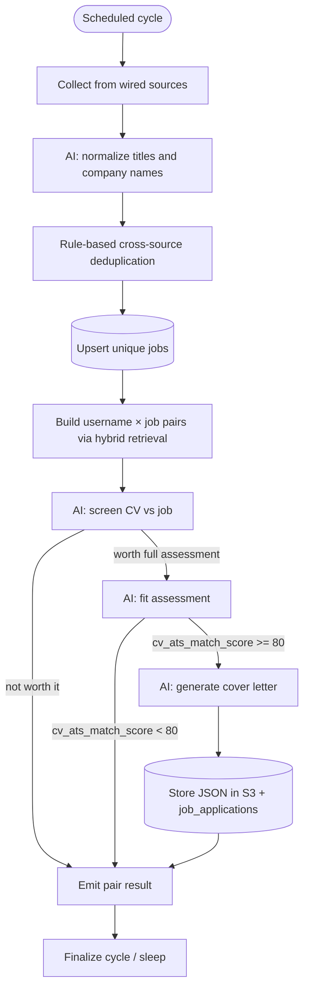

# Architecture and operations

Operator reference for the pipeline, the API, and local dependencies. The product overview and the evaluation numbers are in the [README](../README.md).

## Tech stack

| Concern | Technology |
|---|---|
| Pipeline orchestration | LangGraph + MongoDB checkpointer |
| HTTP API | FastAPI |
| Auth | Auth0 |
| AI agents | PydanticAI (OpenAI + xAI/Grok + DeepInfra) |
| Object storage | S3-compatible (MinIO etc.) |
| Search | OpenSearch (BM25, k-NN, hybrid RRF) |
| Packaging / run | uv, Docker, GHCR |

## Supported sources

| Source | Integration | Wired in pipeline |
|---|---|---|
| LinkedIn (DE) | Apify | yes |
| LinkedIn (Poland) | Apify | yes |
| LinkedIn (United Kingdom) | Apify | yes |
| Arbeitnow | Direct API | yes (Python-keyword filter) |
| HeadHunter (hh.ru) | Public HTML | yes |
| StepStone | Apify parser exists | no |
| Indeed | Apify parser exists | no |

Apify collectors fetch the last successful actor run's dataset by default (`run_apify_task=False`) and do not trigger a new scrape.

## Service components

### Collection service

Ingests job postings from all wired sources and maps them to a shared schema. Manages source-specific collectors and returns a batch for the pipeline.

#### Collectors

Source-specific adapters that handle the details of each provider's API.

- `ApifyCollector` — retrieves Apify actor results (by default the last successful run's dataset, without triggering a new run). Used for LinkedIn DE / Poland / UK with `LinkedinApifyParser`.
- `ArbeitnowCollector` — paginates the Arbeitnow REST API and keeps postings that mention Python in the description.
- `HeadHunterCollector` — downloads hh.ru search pages and each vacancy page for the configured query.

StepStone and Indeed Apify parsers remain in the repo but are not attached to the running collector list.

### Processing pipeline (LangGraph)

The scheduled pipeline lives in `orchestration/` and is the primary processing path. One cycle collects, normalizes, deduplicates, persists unique jobs, then fans out over every `(username, job)` pair that hybrid retrieval keeps.

```bash
uv run run-pipeline
# equivalent: python -m orchestration
```

Design details: [`langgraph-orchestration.md`](langgraph-orchestration.md).

| Stage | Responsibility |
|---|---|
| `collect` | Ingest from wired sources |
| `normalize` | AI-normalize title and company |
| `dedupe` | Rule-based cross-source uniqueness |
| `persist_jobs` | Upsert survivors into `jobs` |
| `build_pairs` | Users × jobs, cut to `PIPELINE_RETRIEVAL_RATIO` of the batch |
| `screen` | CV-only keep/drop |
| `assess` | Full fit assessment (if screening says yes) |
| `cover_letter` | Generate + store letter (if CV ATS score ≥ threshold) |

Pair work is concurrent (`PIPELINE_PAIR_CONCURRENCY`, default 10). Progress is checkpointed in MongoDB (`langgraph_checkpoints`); pair nodes are idempotent and reuse existing screenings, assessments, and cover-letter keys.

A legacy MongoDB stage-queue worker (`workers/job_processing.py`) still exists as a parallel path. It does not run screening and does not use LangGraph checkpoints.

### AI agent — key normalization

A PydanticAI agent (`agents/deduplication.py`) that standardizes job titles and company names across sources. Operates on configurable batches (default 50) with concurrent `asyncio.gather` calls. Consistent keys are a prerequisite for reliable cross-source deduplication.

### Deduplication

Rule-based, no LLM involved:

1. Drop UIDs already present in the `jobs` collection.
2. Intra-batch collapse on `(title_normalized, company_normalized)`, keeping the newest `posted_at`.
3. Cross-run: drop if the same normalized key exists in `jobs` with a `posted_at` within 60 days.

### Screening agent

A PydanticAI agent (`agents/screening.py`) that, given only the candidate CV and the job posting, decides `worth_full_assessment` plus a confidence. Used as a cheap gate before fit assessment. Results are stored in `screenings` (unique on `(username, job_uid)`). Production routing ignores confidence.

Offline evaluation: [`benchmarks/screening/README.md`](../benchmarks/screening/README.md).

### Fit assessment pipeline

A PydanticAI agent (`agents/fit_assessment.py`) that scores each screened-in job against a candidate profile. For each user × job pair it receives the user's profile JSON plus their CV text and returns:

- `cv_ats_match_score`
- `profile_ats_match_score`
- `deal_breakers`
- `summary`

Results are written to a separate `assessments` collection so job records and fit scores remain independently queryable.

Offline evaluation: [`benchmarks/fit_assessment/README.md`](../benchmarks/fit_assessment/README.md).

### Cover letter generation

A PydanticAI agent (`agents/cover_letter_generation.py`) that produces structured `CoverLetterContent` (contact header + titled sections) from the profile, posting, and fit assessment. Triggered when `cv_ats_match_score >= COVER_LETTER_MIN_CV_SCORE` (default 80).

JSON is stored at `job-aggregator/{username}/cover_letters/{job_uid}.json`. The API can return that JSON or render a PDF on the fly (`tools/pdf_generator.py`). The corresponding `job_applications` row records `cover_letter_key`.

### FastAPI service

Entry point: `main.py` (`uv run fastapi run` / `uv run fastapi dev`).

| Area | Endpoints |
|---|---|
| Auth | `POST /users/login`, `POST /users/refresh` (Auth0) |
| Job feed | `POST /jobs/search` — paginated, filterable, sorted feed of job + fit + application status |
| Application status | `PATCH /jobs/{job_uid}/status` |
| Cover letters | `GET /jobs/{job_uid}/cover-letter`, `GET /jobs/{job_uid}/cover-letter-pdf`, `PATCH /jobs/{job_uid}/cover-letter` |

Job-feed queries support remote/source/tag/location filters, ATS score floors, deal-breaker exclusion, and application-stage flags (`applied`, `skipped`, `active_only`).

The Docker image (`Dockerfile`) runs this API. Version tags `v*` are built and pushed to GHCR (`.github/workflows/docker-publish.yml`).

### Retrieval

`search/` indexes jobs in OpenSearch and serves BM25, k-NN, and hybrid reciprocal-rank fusion. `build_pairs` keeps the top `PIPELINE_RETRIEVAL_RATIO` of the current batch (default 0.5, clamped by `PIPELINE_RETRIEVAL_MIN_K` / `PIPELINE_RETRIEVAL_MAX_K`). On the 300-job eval corpus that cutoff is K=150.

Offline evaluation: [`benchmarks/retrieval/README.md`](../benchmarks/retrieval/README.md).

## Job processing flow



Default schedule: every 12 hours (`PIPELINE_SCHEDULE_SECONDS`).

## MongoDB collections

| Collection | Purpose |
|---|---|
| `jobs` | Canonical job store (upserted after deduplication) |
| `checkpoints` | Per-source collector `posted_at` high-water mark |
| `user_profiles` | Candidate profiles used for fit assessment |
| `screenings` | `{username, job_uid, worth_full_assessment, confidence}` |
| `assessments` | `{username, job_uid, assessment}` fit results |
| `job_applications` | Per-user application status and cover-letter keys |
| `failed_tasks` | Pipeline node failures (collect / normalize / pair LLM steps) |
| `pricing` | LLM rate cards (`model_name`, `input_usd_per_1m`, `output_usd_per_1m`) for cost accounting |
| `langgraph_checkpoints` / `langgraph_checkpoint_writes` | LangGraph checkpointer |
| `job_processing` / `failed_entries` | Legacy stage-queue worker only |

## Object storage (S3-compatible)

| Object | Key |
|---|---|
| User CV | `job-aggregator/{username}/cv.pdf` |
| Cover letter JSON | `job-aggregator/{username}/cover_letters/{job_uid}.json` |

The endpoint is configurable via `S3_ENDPOINT_URL` to support MinIO or any S3-compatible service.

## Observability, cost accounting and dashboards

The API and the pipeline runner are separate processes, so each publishes its own Prometheus exposition endpoint: the API on `:8000/metrics`, the worker on `:8001/metrics` (`WORKER_METRICS_PORT`). Grafana Alloy scrapes both and remote-writes to Prometheus.

| Metric | Type | Labels |
|---|---|---|
| `llm_tokens_total` | counter | `agent`, `model`, `type` (`prompt` / `completion`) |
| `llm_cost_estimated_usd_total` | counter | `agent`, `model` |
| `llm_request_duration_seconds` | histogram | `agent`, `model` |
| `search_query_duration_seconds` | histogram | `type` (`hybrid` / `bm25` / `knn`), `status` |
| `search_feed_query_duration_seconds` | histogram | `status` |
| `search_queries_total` / `search_hits_count` | counter / histogram | `type`, `status` |
| `pipeline_cycle_duration_seconds` | histogram | `status` |
| `pipeline_node_duration_seconds` | histogram | `node` |
| `pipeline_tasks_total` | counter | `node`, `status` (`success` / `failure`) |
| `job_descriptions_total` | counter | `stage` (`collection` / `retrieval` / `screening` / `assessment`), `source` |
| `collector_entries_dropped_total` | counter | `source`, `reason` (`parse`) |
| `mongo_checkpoint_duration_seconds` | histogram | — |
| `dependency_up` | gauge | `dependency` (published by `/readyz`) |
| `http_requests_total` / `http_request_duration_seconds` | counter / histogram | `method`, `path` (route template), `status` |

Spend is estimated per call from the `pricing` collection, cached in-process for `PRICING_CACHE_TTL_SECONDS` and backed by static defaults in `monitoring/pricing.py`, so cost telemetry survives an unreachable or unseeded MongoDB.

`monitoring/` holds the Alloy pipeline, the Prometheus scrape and SLO alert rules, and three Grafana dashboard JSON files (LLM Cost & Token Accounting, Product & Search Performance, Pipeline & System Health). Those boards run in Grafana Cloud. The Grafana service in `docker-compose.yml` mounts `monitoring/grafana/provisioning`, and that directory is not in the repo, so `docker compose up -d` does not produce a working local Grafana. The still in the README was captured from Grafana Cloud.

SLOs: 95% of corpus searches under 150ms, 95% of assessed feed queries under 200ms, and a pipeline task failure rate under 0.5%.

Set `METRICS_ENABLED=false` to drop both metrics endpoints. Set `METRICS_REMOTE_WRITE_URL` to ship the same timeseries to Grafana Cloud Mimir instead of the local Prometheus.

## Development setup

```bash
uv sync

cp .env.example .env

# MongoDB, OpenSearch, Prometheus, Alloy, and a Grafana container.
# Grafana's provisioning directory is absent, so this is not a local dashboard stack.
docker compose up -d

# containerised api + pipeline worker, the two scrape targets
docker compose --profile app up -d

uv run run-pipeline

uv run fastapi dev

uv run pytest

# include tests that call Apify or OpenAI
uv run pytest --run-priced
```

OpenSearch Dashboards (`:5601`) is behind the `tools` profile: `docker compose --profile tools up -d`.

Offline benchmarks need the private datasets. Entry points and the public reports are in [`evals.md`](evals.md).

### Required environment variables

| Variable | Purpose |
|---|---|
| `OPENAI_API_KEY` | OpenAI models (`gpt-5.6-luna`, embeddings) |
| `GROK_API_KEY` | xAI models (`grok-4.3`, `grok-4.5`) |
| `DEEPINFRA_API_KEY` | DeepInfra (`glm-5.3-flash` and the OSS models) |
| `APIFY_API_KEY` | Apify authentication |
| `MONGODB_USER`, `MONGODB_PASSWORD` | MongoDB auth |
| `MONGODB_HOST`, `MONGODB_PORT` | MongoDB host (defaults: `localhost`, `27017`) |
| `S3_ENDPOINT_URL` | S3-compatible storage endpoint |
| `S3_ACCESS_KEY`, `S3_SECRET_KEY` | S3 credentials |
| `S3_REGION`, `S3_BUCKET_NAME` | S3 bucket config |
| `AUTH0_DOMAIN`, `AUTH0_CLIENT_ID`, `AUTH0_CLIENT_SECRET`, `AUTH0_AUDIENCE` | API auth |
| `APIFY_LINKEDIN_TASK_ID` | LinkedIn DE Apify task |
| `APIFY_LINKEDIN_PL_TASK_ID` | LinkedIn Poland Apify task |
| `APIFY_LINKEDIN_UK_TASK_ID` | LinkedIn UK Apify task |

Optional tuning variables: `DEDUPLICATION_BATCH_SIZE`, `DEDUPLICATION_MODEL`, `SCREENING_MODEL`, `FIT_ASSESSMENT_MODEL`, `COVER_LETTER_MODEL`, `COVER_LETTER_MIN_CV_SCORE`, `PIPELINE_PAIR_CONCURRENCY`, `PIPELINE_SCHEDULE_SECONDS`, `ARBEITNOW_MAX_PAGES`, `HH_MAX_PAGES`, `DEBUG_MODE`, `LOG_DIR`, `TEMP_DIR`, `METRICS_ENABLED`, `WORKER_METRICS_HOST`, `WORKER_METRICS_PORT`, `PRICING_CACHE_TTL_SECONDS`, and per-collection name overrides (`MONGODB_JOBS_COLLECTION`, `MONGODB_SCREENINGS_COLLECTION`, etc.). `LOG_DIR` and `TEMP_DIR` are resolved to absolute paths (relative values are interpreted against the application root) and may point outside the app directory in production.

Default models: deduplication, fit assessment, and cover letters use `gpt-5.6-luna`. `SCREENING_MODEL` defaults to `glm-5.3-flash`, the bake-off winner. The live environment still sets screening to `gpt-5.6-luna` until that switch is deployed.

## Roadmap

- Description enrichment agent to extract structured properties from free-text.
- Adjusted / tailored CV generation.
- Rule-based hard requirement filter (language, technologies, seniority) before AI scoring.
- Notification service for new relevant jobs.

The React client lives in [`job-aggregator-client`](https://github.com/cshadiev/job-aggregator-client). Hybrid retrieval is the pair gate described above; the design note is [`candidate-job-ranking.md`](candidate-job-ranking.md).
