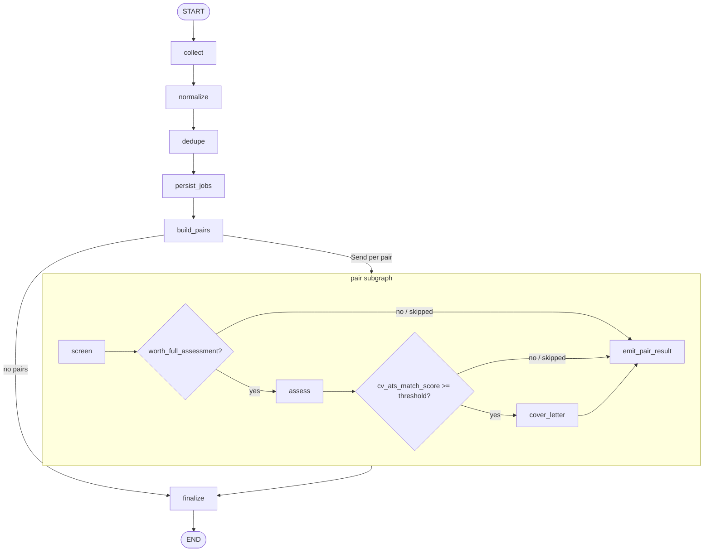

# LangGraph Orchestration Implementation

How the job pipeline is orchestrated with LangGraph in `orchestration/`.
Design history and trade-offs live in [`planning/langgraph-pipeline.md`](planning/langgraph-pipeline.md).

## Purpose

One scheduled cycle collects postings, normalizes and deduplicates them, persists unique jobs, then fans out over every `(username, job)` pair for screening → optional fit assessment → optional cover letter. In-flight progress is stored in LangGraph checkpoints; durable domain results go to MongoDB and object storage.

Entry point:

```bash
python -m orchestration
```

## Module layout

| Path | Role |
|---|---|
| `orchestration/runner.py` | Schedule loop, Mongo clients, checkpointer, `ainvoke` |
| `orchestration/graph.py` | Parent graph + pair subgraph compilation |
| `orchestration/state.py` | `PipelineState` / `PairState`, factories, pair list, summaries |
| `orchestration/routing.py` | Pure post-screen / post-assess route helpers |
| `orchestration/deps.py` | `PipelineDeps` + `build_deps` / collectors |
| `orchestration/nodes/batch.py` | Collect → normalize → dedupe → persist → build pairs → fanout → finalize |
| `orchestration/nodes/pair.py` | Screen → assess → cover letter → emit result |

## Graph topology



- Parent graph: `build_pipeline_graph(deps, checkpointer)` — compiled with `MongoDBSaver`.
- Pair subgraph: `build_pair_subgraph(deps)` — compiled without its own checkpointer; runs as the `pair_pipeline` node.
- Fan-out after `build_pairs` uses LangGraph `Send` to `pair_pipeline` (or jumps straight to `finalize` when there are no pairs).
- Pair concurrency is capped by invoke config `max_concurrency` (`PIPELINE_PAIR_CONCURRENCY`).

## State

### `PipelineState` (parent)

| Channel | Meaning |
|---|---|
| `cycle_id` | UUID for the current schedule cycle (logging / `failed_tasks`) |
| `collected` | Postings in flight (raw → normalized) |
| `normalize_failed` | Compact normalize failure records |
| `unique_jobs` | Post-dedupe survivors |
| `pairs` | Cartesian product `{username, job_uid, job}` |
| `pair_results` | Reducer (`operator.add`) — compact summaries from each pair |

Batch list channels are cleared at cycle start (`collect` uses `Overwrite([])` for `pair_results`) and again in `finalize` so a long-lived thread checkpoint does not grow without bound.

### `PairState` (subgraph)

| Channel | Meaning |
|---|---|
| `cycle_id`, `username`, `job` | Pair identity + posting payload |
| `screening` | Screening agent result (or `{}`) |
| `assessment` | Fit assessment or `None` |
| `cover_letter_key` | Object storage key or `None` |
| `skipped_reason` | Set on recoverable pair failure; forces early exit routing |
| `pair_results` | Same reducer; `emit_pair_result` appends one summary |

## Batch nodes

| Node | Behavior |
|---|---|
| `collect` | `CollectionService.collect()`; stores invalid entries as `failed_tasks`; resets batch channels for the new cycle |
| `normalize` | Validates → `collection_service.normalize`; failures → `failed_tasks` + `normalize_failed` |
| `dedupe` | `collection_service.deduplicate` → `unique_jobs` |
| `persist_jobs` | `repository.upsert_jobs`; on failure records `failed_tasks` and re-raises |
| `build_pairs` | `get_user_profiles()` × `unique_jobs` via `build_pair_list` |
| `fanout` | Returns `"finalize"` or a `Send("pair_pipeline", PairState)` list |
| `finalize` | Logs cycle aggregates; clears batch channels with `Overwrite` for `pair_results` |

Collectors wired in `build_collectors`: LinkedIn Apify tasks (DE / PL / UK, `run_apify_task=False`) plus Arbeitnow.

## Pair nodes

All pair LLM / S3 work is **idempotent**: if a screening, assessment, or cover-letter key already exists for `(username, job_uid)`, the node reuses it and skips generation.

| Node | Behavior |
|---|---|
| `screen` | Load CV from object storage → `ScreeningAgent` → `store_screening` |
| `assess` | Load profile + CV → `FitAssessmentAgent` → `store_assessment` |
| `cover_letter` | Generate JSON, upload to object storage, update `job_applications.cover_letter_key` |
| `emit_pair_result` | Append `pair_result_summary` to parent `pair_results` |

On exception, pair nodes call `_fail_pair`: write `failed_tasks`, set `skipped_reason`, and let routing skip remaining LLM steps. The pair still emits a summary.

### Routing

Pure helpers in `orchestration/routing.py` (covered by unit tests):

- After screen → `assess` iff `worth_full_assessment` and no `skipped_reason`; else `pair_end` (`emit_pair_result`).
- After assess → `cover_letter` iff `cv_ats_match_score >= COVER_LETTER_MIN_CV_SCORE` and no `skipped_reason`; else `pair_end`.

## Retry policy and failed tasks

There is **no automatic replay** of `failed_tasks`. Recovery is crash-resume via LangGraph checkpoints plus idempotent domain writes. The `FailedTask.retryable` field exists on the model (default `False`) but is not set or consumed by the runner today.

### Failure modes

| Scope | What happens | Cycle continues? |
|---|---|---|
| Collect invalid entries | One `failed_tasks` row per invalid (`node="collect"`); valid postings proceed | Yes |
| Normalize per-posting failure | `failed_tasks` (`node="normalize"`) + entry in `normalize_failed`; successes proceed to dedupe | Yes |
| `persist_jobs` exception | `failed_tasks` then **re-raise** — hard batch failure | No (cycle aborts) |
| Pair `screen` / `assess` / `cover_letter` exception | `_fail_pair` → `failed_tasks`, set `skipped_reason`, route to `emit_pair_result` | Yes (other pairs keep running) |

Pair failures never fail the parent graph. Batch soft failures isolate bad items; only `persist_jobs` (and uncaught errors above it) abort the invoke.

### `FailedTask` envelope

Stored in `failed_tasks` via `MongoJobsRepository.store_failed_task` (`models/failed_tasks.py`):

| Field | Role |
|---|---|
| `node` | `collect` \| `normalize` \| `dedupe` \| `persist_jobs` \| `screen` \| `assess` \| `cover_letter` |
| `thread_id` | `PIPELINE_THREAD_ID` |
| `cycle_id` | Current cycle UUID (correlate failures for one schedule run) |
| `error` | Stringified error / invalid-entry message |
| `failed_at` | UTC timestamp |
| `retryable` | Reserved; always default `False` in current writers |
| `payload` | Node-specific context (e.g. raw entry, `uid`, `username` / `job_uid`, `n_jobs`) |

Index created at runner startup: `(cycle_id, node)` (`ensure_pipeline_indexes`).

### Crash resume (effective retry)

1. Process dies mid-cycle → next `ainvoke` on the same `PIPELINE_THREAD_ID` resumes from the Mongo checkpointer.
2. Pair nodes are **read-before-write**:
   - `screen` / `assess`: reuse stored screening or assessment if present
   - `cover_letter`: reuse existing `job_applications.cover_letter_key`
3. `upsert_jobs` is duplicate-safe by `uid` so overlapping collects do not crash persist.
4. `store_screening` treats `DuplicateKeyError` on `(username, job_uid)` as success (unique index).

Completed pairs are not re-billed; unfinished pairs run again. Failed pairs from a prior attempt are **not** automatically re-queued — a later cycle only reprocesses them if the same `(username, job)` appears again and no successful domain record exists yet (e.g. no screening row after a screen failure).

### What is not retried

- Rows in `failed_tasks` (append-only audit; no worker drains them).
- Agent-level LLM retries inside orchestration nodes (none wired; `FIT_ASSESSMENT_MAX_RETRIES` is unused by this path).
- Concurrent runners on the same `thread_id` (unsupported).

## Runner and durability

`runner.main()` loops forever:

1. Build async + sync Mongo clients.
2. Create `MongoDBSaver` on the sync client (`langgraph_checkpoints` / `langgraph_checkpoint_writes`).
3. `build_deps` → `ensure_pipeline_indexes` → `build_pipeline_graph`.
4. `run_once`: `ainvoke(new_pipeline_state(cycle_id=…), config={thread_id, max_concurrency})`.
5. Sleep `PIPELINE_SCHEDULE_SECONDS` (default 12h).

A single long-lived `PIPELINE_THREAD_ID` (default `job-pipeline`) is used so each scheduled invoke continues the same checkpoint thread. Domain side effects remain the source of truth for resume safety; pair nodes skip work already persisted.

| Store | Use |
|---|---|
| `langgraph_checkpoints` / `langgraph_checkpoint_writes` | Graph checkpoint / pending writes |
| `jobs` | Unique postings after dedupe |
| `screenings` | Screening results |
| `assessments` / `job_applications` | Fit assessment + application row / cover letter key |
| `failed_tasks` | Node failures (batch + pair) |
| `checkpoints` | Per-source collector watermarks (unchanged `CollectionService`) |
| Object storage | User CVs (read) and cover-letter JSON (write) |

Sync `MongoClient` is required by `MongoDBSaver`; app I/O uses `AsyncMongoClient`.

## Dependencies (`PipelineDeps`)

Injected into node factories:

- `CollectionService` (+ deduplication agent)
- `MongoJobsRepository`, `ObjectStorage`
- `ScreeningAgent`, `FitAssessmentAgent`, `CoverLetterGenerationAgent`
- `cover_letter_min_cv_score`, `screening_model`, `thread_id`
- Shared `ClientSession` and `AsyncMongoClient`

Model names come from config (`SCREENING_MODEL`, `FIT_ASSESSMENT_MODEL`, `COVER_LETTER_MODEL`, `DEDUPLICATION_MODEL`).

## Configuration knobs

| Key | Default | Role |
|---|---|---|
| `PIPELINE_THREAD_ID` | `job-pipeline` | LangGraph thread / checkpoint id |
| `PIPELINE_PAIR_CONCURRENCY` | `10` | `max_concurrency` for pair fan-out |
| `PIPELINE_SCHEDULE_SECONDS` | `43200` | Delay between cycles |
| `DEDUPLICATION_MODEL` | `gpt-5.6-luna` | Deduplication agent model |
| `SCREENING_MODEL` | `gpt-5.6-luna` | Screening agent model |
| `FIT_ASSESSMENT_MODEL` | `gpt-5-mini` | Fit assessment agent model |
| `COVER_LETTER_MODEL` | `gpt-5-mini` | Cover letter agent model |
| `COVER_LETTER_MIN_CV_SCORE` | `80` | Gate from assess → cover letter |
| `MONGODB_LANGGRAPH_CHECKPOINT_COLLECTION` | `langgraph_checkpoints` | Checkpointer blobs |
| `MONGODB_LANGGRAPH_WRITES_COLLECTION` | `langgraph_checkpoint_writes` | Checkpointer writes |

## Tests

`tests/unit/test_pipeline_routing.py` covers:

- `route_after_screen` / `route_after_assess` (threshold, skip, missing data)
- `build_pair_list` cartesian product
- State factories, `cleared_batch_state`, `pair_result_summary`

## Relation to legacy worker

The Mongo stage-queue worker in `workers/job_processing.py` is unchanged. This package is a parallel orchestration path that does not use `job_processing` / `failed_entries` for intermediate work.
