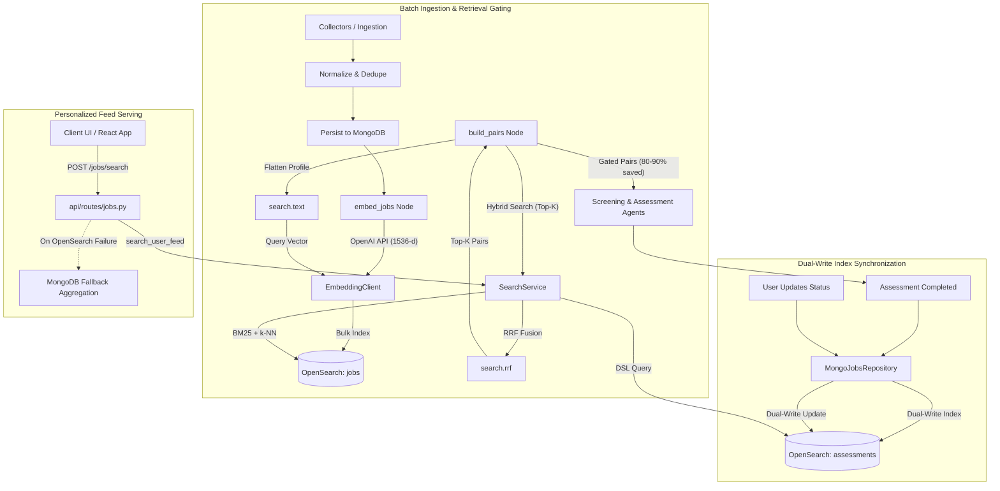
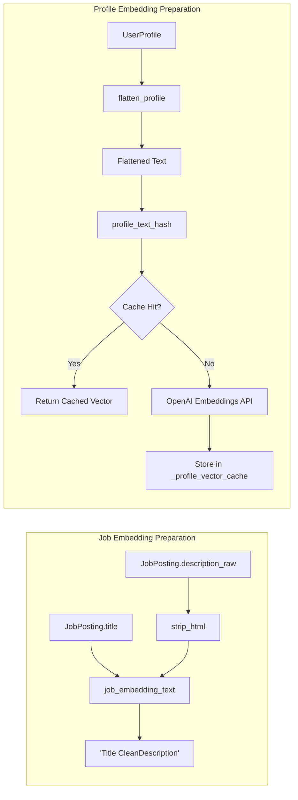
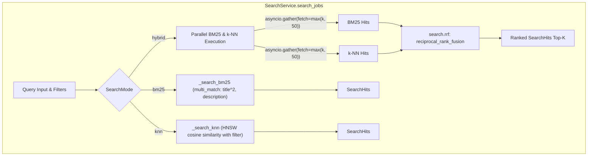

# Search Module Technical Specification

This document is the authoritative technical specification for the `search/` module in the Job Aggregator system. It details the architecture, OpenSearch index schemas, embedding pipelines, retrieval algorithms, API and orchestration integrations, observability, and testing strategies.

---

## 1. Module Overview & Core Responsibilities

The `search/` module provides a high-performance, OpenSearch-backed dual-purpose retrieval tier designed to solve two core challenges:

1. **Batch Pipeline Retrieval Gating (Candidate-to-Job Matching):**
   Replaces the costly $O(\text{users} \times \text{jobs})$ Cartesian product pairing with a hybrid top-$K$ retrieval step. For each candidate profile, the pipeline retrieves the most relevant newly collected job postings using hybrid search (BM25 lexical + dense vector embeddings fused via Reciprocal Rank Fusion), reducing downstream LLM screening and fit assessment calls by 80–90%.

2. **Real-Time Personalized User Feed Discovery:**
   Powers candidate feed exploration (`POST /jobs/search`) with sub-50ms latency by querying a denormalized index of evaluated jobs. Supports multi-field free-text search (`q`), ATS match score ranges, deal-breaker filtering, location wildcards, application stage filters, and flexible sorting with pagination.

### Subsystem Boundaries

- **OpenSearch Async Client:** Connection lifecycle and cluster health checks using `opensearch-py` async transport.
- **Text Normalization & Hashing:** Strips HTML formatting, normalizes whitespace, formats dense embedding strings, and extracts flattened candidate representations with SHA-256 digest caching.
- **Batch Vector Embeddings:** Async client for OpenAI `text-embedding-3-small` (1536-d) with chunking and in-memory process caching.
- **Application-Level Fusion:** Deterministic Python implementation of Reciprocal Rank Fusion ($k=60$) eliminating reliance on cluster-side plugin variants.
- **Resilience & Fallback:** Comprehensive error trapping on bulk operations and graceful fallback to MongoDB aggregation for user feed queries during OpenSearch outages.
- **Telemetry & Tracing:** OpenTelemetry instrumentation across search operations.

---

## 2. System Architecture & Component Layout

### File Layout

| File | Purpose | Key Exports |
|---|---|---|
| [`search/__init__.py`](../search/__init__.py) | Module docstring | Package boundary |
| [`search/client.py`](../search/client.py) | OpenSearch client factory | `build_opensearch_client` |
| [`search/models.py`](../search/models.py) | Data transfer objects & Pydantic models | `IndexedJob`, `DenormalizedAssessment`, `SearchFilters`, `SearchHit`, `SearchHits`, `SearchMode`, `assessment_document_id` |
| [`search/mappings.py`](../search/mappings.py) | OpenSearch index settings and mapping DSL | `JOBS_INDEX_SETTINGS`, `ASSESSMENTS_INDEX_SETTINGS` |
| [`search/text.py`](../search/text.py) | Text cleaners and profile flattening utilities | `strip_html`, `job_embedding_text`, `flatten_profile`, `profile_text_hash` |
| [`search/embeddings.py`](../search/embeddings.py) | OpenAI embeddings client & process cache | `EmbeddingClient`, `clear_profile_embedding_cache` |
| [`search/rrf.py`](../search/rrf.py) | Reciprocal Rank Fusion algorithm | `reciprocal_rank_fusion` |
| [`search/search_service.py`](../search/search_service.py) | High-level search and indexing service | `SearchService` |

### Architecture & Data Flow



---

## 3. OpenSearch Index Schemas & Storage Layout

The system maintains two dedicated OpenSearch indices with independent lifecycles.

### 1. `jobs` Index (Corpus Retrieval)

Stores raw job postings augmented with dense vector embeddings for hybrid retrieval during batch orchestration and offline benchmarking.

- **Index Settings:**
  - `index.knn: true`
  - `index.knn.algo_param.ef_search: 100` (search-time exploration depth)
  - `number_of_shards: 1`, `number_of_replicas: 0` (local single-node default)
  - Custom analyzer `job_english` (standard tokenizer with `_english_` stopwords)
- **Field Mappings:**

| Field | Type | Details |
|---|---|---|
| `uid` | `keyword` | Unique posting identifier |
| `title` | `text` | Analyzed with `english` analyzer (boosted $2\times$ during search) |
| `description` | `text` | Cleaned text analyzed with `english` analyzer |
| `embedding` | `knn_vector` | `dimension: 1536`, `method: {name: "hnsw", space_type: "cosinesimil", engine: "lucene"}` |
| `source` | `keyword` | Job board source (e.g., `arbeitnow`, `linkedin_de`) |
| `company` | `keyword` | Company name |
| `location` | `keyword` | Location string |
| `url` | `keyword` | Original job URL |
| `job_types` | `keyword` | Array of job type tags |
| `remote` | `boolean` | Remote eligibility flag |
| `posted_at` | `date` | Original publication timestamp |

> **Note on Tags:** As an architectural decision, unstructured scraper `tags` are excluded from `jobs` indexing and search analyzers because raw scraper tags contain unstandardized, noisy keywords that introduce false-positive matches.

### 2. `assessments` Index (Assessed User Feed)

Stores fully denormalized assessment documents containing candidate metadata, fit assessment outputs, application status, and full job posting details. Denormalization avoids expensive runtime `$lookup` joins across collections.

- **Document ID:** Composite key format `{username}_{job_uid}` via `assessment_document_id(username, job_uid)`.
- **Field Mappings:**

| Field | Type | Details |
|---|---|---|
| `username` | `keyword` | Candidate username |
| `job_uid` | `keyword` | Job unique identifier |
| `cv_ats_match_score` | `float` | Candidate CV-to-job ATS match score (0–100) |
| `profile_ats_match_score` | `float` | Candidate Profile-to-job ATS match score (0–100) |
| `deal_breakers` | `keyword` | Array of identified candidate deal-breakers |
| `summary` | `text` | Assessment summary analyzed with `english` analyzer |
| `status` | `object` | Embedded `JobApplicationStatus` (`applied`, `skipped`, `stage`, `active`, `cover_letter_key`, etc.) |
| `job` | `object` | Embedded `JobPosting` (`title`, `company`, `description`, `location`, `remote`, `posted_at`, `source`, `url`, `tags`, etc.) |

---

## 4. Text Preparation & Vector Embedding Pipeline

The text processing subsystem converts raw and structured models into normalized strings for lexical analyzers and embedding models.



### Text Normalization Utilities (`search/text.py`)

- **`strip_html(raw: str) -> str`:**
  Unescapes HTML entities, strips tags via regular expression `r"<[^>]+>"`, and collapses consecutive whitespace characters.
- **`job_embedding_text(title: str, description_raw: str) -> str`:**
  Concatenates job title with cleaned HTML-stripped description to form a unified text representation.
- **`flatten_profile(profile: UserProfile) -> str`:**
  Constructs a dense representation of candidate strengths by extracting and joining:
  1. Profile title and summary (headline + description).
  2. Technical skills across categories: `backend`, `frontend`, `infrastructure`, `databases`, and `aiMl`.
  3. Work experience history: title, company, responsibilities, and technology stack.
- **`profile_text_hash(text: str) -> str`:**
  Computes a deterministic SHA-256 hexadecimal digest of the flattened profile string used as an in-memory caching key.

### Embedding Client (`search/embeddings.py`)

- **Model:** `text-embedding-3-small` (dimension: 1536).
- **Batching:** `embed_texts` partitions large text sequences into chunks governed by `EMBEDDING_BATCH_SIZE` (default: 64) over a shared asynchronous `aiohttp.ClientSession`.
- **In-Memory Caching:** `embed_profile` uses `_profile_vector_cache` keyed on `profile_text_hash(text)` to eliminate redundant OpenAI API calls during batch pipeline cycles when candidate profiles have not changed.
- **Cache Management:** `clear_profile_embedding_cache()` allows clearing the cache during testing or candidate updates.

---

## 5. Retrieval Modes & Ranking Algorithms

The `SearchService.search_jobs` method supports three retrieval modes for the `jobs` index:



### 1. BM25 Lexical Retrieval (`_search_bm25`)

Executes an OpenSearch `multi_match` query using `best_fields` targeting `title` (boosted $2\times$) and `description`, combined with structured metadata filter clauses (`uids`, `remote`, `sources`, `location`).

```json
{
  "size": 20,
  "query": {
    "bool": {
      "must": [
        {
          "multi_match": {
            "query": "Python FastAPI",
            "fields": ["title^2", "description"],
            "type": "best_fields"
          }
        }
      ],
      "filter": [
        {"terms": {"uid": ["uid-1", "uid-2"]}},
        {"term": {"remote": true}}
      ]
    }
  }
}
```

### 2. Dense Vector Retrieval (`_search_knn`)

Executes an Approximate Nearest Neighbor (ANN) search on the `embedding` field using the query embedding vector, applying structured pre-filters directly within the k-NN query block.

```json
{
  "size": 20,
  "query": {
    "knn": {
      "embedding": {
        "vector": [0.012, -0.043, "..."],
        "k": 20,
        "filter": {
          "bool": {
            "filter": [
              {"terms": {"uid": ["uid-1", "uid-2"]}}
            ]
          }
        }
      }
    }
  }
}
```

### 3. Hybrid Search & Reciprocal Rank Fusion (`_search_hybrid`)

Combines lexical precision with semantic generalization:
1. **Parallel Overfetching:** Concurrently issues BM25 and k-NN queries with an overfetch size of $\max(\text{size}, 50)$.
2. **Application-Level RRF:** Fuses the two ranked candidate UID lists using:
   $$\text{RRF\_Score}(d) = \sum_{m \in \{\text{bm25}, \text{knn}\}} \frac{1}{k + \text{rank}_m(d)}$$
   where $k = 60$ and $\text{rank}_m(d)$ is the 1-based rank position of document $d$ in retrieval modality $m$.
3. **Score Resolution:** If a document appears in both lists, its scores sum; if missing from one list, it receives zero contribution from that modality.
4. **Tie-Breaking:** Results are sorted by descending RRF score, with document UID as a secondary deterministic tie-breaker.

---

## 6. Personalized User Feed Engine

The `SearchService.search_user_feed` method powers `POST /jobs/search` by querying the `assessments` index.

### Query Construction (`_user_feed_query_body`)

- **User Scoping:** Mandatory `{"term": {"username": username}}` filter clause.
- **Match Score Thresholds:** Optional `range` filters on `cv_ats_match_score` and `profile_ats_match_score`.
- **Deal-Breakers Exclusion:** When `exclude_deal_breakers=True`, appends `{"bool": {"must_not": [{"exists": {"field": "deal_breakers"}}]}}`.
- **Location Wildcard:** Case-insensitive wildcard match `*location*` on `job.location`.
- **Application Status & Stage:** Filters for `status.applied`, `status.skipped`, `status.active`, and `status.stage`.
- **Full-Text Keyword Search (`q`):** When provided, constructs a `multi_match` clause with field boosting:
  - `job.title^3` (title weighted $3\times$)
  - `job.company^2` (company weighted $2\times$)
  - `job.description`
- **Sorting & Pagination:** Supports sorting by `job.posted_at`, `cv_ats_match_score`, or `profile_ats_match_score` (ascending or descending), with secondary deterministic sort on `job_uid`. Employs offset pagination (`from`, `size`) with `track_total_hits: true`.

---

## 7. System Integrations & Data Lifecycles

### 1. LangGraph Batch Orchestration (`orchestration/nodes/batch.py`)

- **`embed_jobs` Node:** Executed immediately after `persist_jobs`. Computes embeddings for all newly deduplicated jobs and calls `SearchService.bulk_index_jobs`.
- **`build_pairs` Node (Retrieval Gating):**
  - When `PIPELINE_PAIR_MODE="topk"`, iterates through candidate profiles, extracts flattened text and embedding vectors, and calls `SearchService.search_jobs(mode="hybrid", filters=SearchFilters(uids=unique_uids), size=k)`.
  - Restricts pair generation to top-$K$ candidates (default $K=20$), replacing full Cartesian fan-out and logging `llm_calls_saved`.

### 2. MongoDB Repository Dual-Write (`repository/mongo_jobs_repository.py`)

- **Assessment Persistence:** When `store_assessment` saves an assessment to MongoDB, it calls `SearchService.index_assessment` to maintain index synchronization.
- **Status Updates:** When `update_job_application_status` modifies application state in MongoDB, it calls `SearchService.update_assessment_status` with partial updates.

### 3. FastAPI Endpoints

- **`POST /jobs/search` (`api/routes/jobs.py`):** Primary handler calls `search_service.search_user_feed`. If OpenSearch is unavailable or fails, it catches the exception and falls back to MongoDB aggregation (`jobs_repository.get_job_feed_items`).
- **`GET /readyz` (`api/routes/health.py`):** Readiness probe includes OpenSearch cluster availability via `search_service.ping()`.

### 4. Migration & Backfill Utilities

- **`scripts/backfill_job_embeddings.py`:** Iterates historical MongoDB jobs, generates dense vector embeddings via `EmbeddingClient`, and bulk-indexes into OpenSearch `jobs`.
- **`scripts/migrate_denormalized_assessments.py`:** Denormalizes legacy MongoDB assessments by embedding related `job` and `status` objects, then bulk-indexes into OpenSearch `assessments`.

### 5. Offline Retrieval Benchmark Harness (`benchmarks/retrieval/`)

- Compares retrieval performance across BM25, k-NN, and Hybrid RRF against frozen datasets:
  - `06092026`: CI smoke dataset (10 queries, 20 documents).
  - `06092026_comprehensive`: Gold-standard benchmark (100 queries, 387 documents, 21k+ relevance judgements).
- Evaluates **Recall@K**, **nDCG@K**, and **MRR** across multiple rank cutoffs ($K \in \{5, 10, 20\}$).

---

## 8. Configuration, Observability & Error Handling

### Configuration Parameters

| Environment Variable | Default | Description |
|---|---|---|
| `OPENSEARCH_HOST` | `localhost` | OpenSearch server host |
| `OPENSEARCH_PORT` | `9200` | OpenSearch HTTP/REST port |
| `OPENSEARCH_USE_SSL` | `false` | Enable HTTPS connection |
| `OPENSEARCH_VERIFY_CERTS` | `false` | Verify SSL certificates |
| `OPENSEARCH_USER` | `None` | HTTP Basic Auth username |
| `OPENSEARCH_PASSWORD` | `None` | HTTP Basic Auth password |
| `OPENSEARCH_INDEX_NAME` | `jobs` | Name of the global jobs corpus index |
| `OPENSEARCH_ASSESSMENTS_INDEX_NAME` | `assessments` | Name of the denormalized assessments index |
| `EMBEDDING_MODEL` | `text-embedding-3-small` | OpenAI embedding model name |
| `EMBEDDING_DIMENSIONS` | `1536` | Vector dimensionality |
| `EMBEDDING_BATCH_SIZE` | `64` | Batch chunk size for OpenAI embedding API calls |
| `PIPELINE_PAIR_MODE` | `topk` | Pairing mode: `topk` (hybrid retrieval) or `cartesian` |
| `PIPELINE_RETRIEVAL_K` | `20` | Top-$K$ cutoff for pipeline retrieval gating |

### Observability & Telemetry

- **OpenTelemetry Spans:**
  - `search.jobs`: Attributes `search.mode` (`bm25`, `knn`, `hybrid`) and `search.size`.
  - `search.user_feed`: Attributes `search.page` and `search.page_size`.
- **Bulk Error Validation:**
  `_raise_if_bulk_errors` inspects OpenSearch bulk API response payloads and raises a descriptive `RuntimeError` with up to 5 individual item failure reasons if any action fails.
- **Index Lifecycle Management:**
  `SearchService.ensure_indices()` idempotently checks and creates `jobs` and `assessments` indices with predefined settings and mappings on application startup.

---

## 9. Testing & Quality Assurance

### Test Suite Structure

1. **Unit Tests:**
   - [`tests/unit/test_search_text.py`](../tests/unit/test_search_text.py): Validates HTML tag stripping, entity unescaping, whitespace collapsing, job text generation, and profile flattening with SHA-256 hash stability.
   - [`tests/unit/test_search_rrf.py`](../tests/unit/test_search_rrf.py): Validates RRF reciprocal rank mathematics, multi-list ranking, truncation sizes, and rank deduplication.
   - [`tests/unit/test_build_pairs_gating.py`](../tests/unit/test_build_pairs_gating.py): Validates top-$K$ pair gating logic in the orchestration pipeline.

2. **Integration Tests:**
   - [`tests/integration/test_search_service.py`](../tests/integration/test_search_service.py): Runs against a live OpenSearch instance, validating `ensure_indices`, `bulk_index_jobs`, BM25 / k-NN / Hybrid retrieval, and `search_user_feed` filtering and pagination.

3. **CI Retrieval Smoke Benchmark:**
   - [`benchmarks/retrieval/test_retrieval_smoke.py`](../benchmarks/retrieval/test_retrieval_smoke.py): Executes fast, zero-cost retrieval regression tests in GitHub Actions CI against a local OpenSearch service container.
